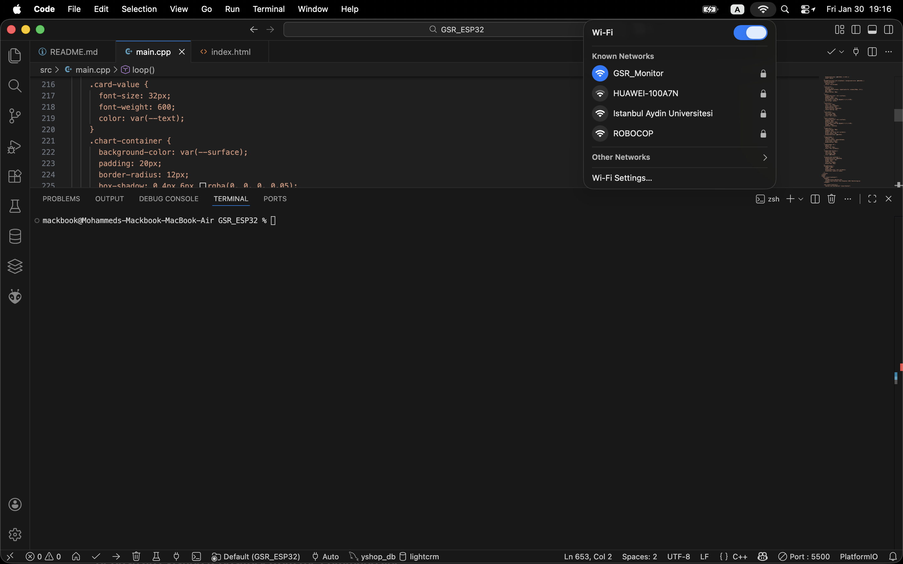
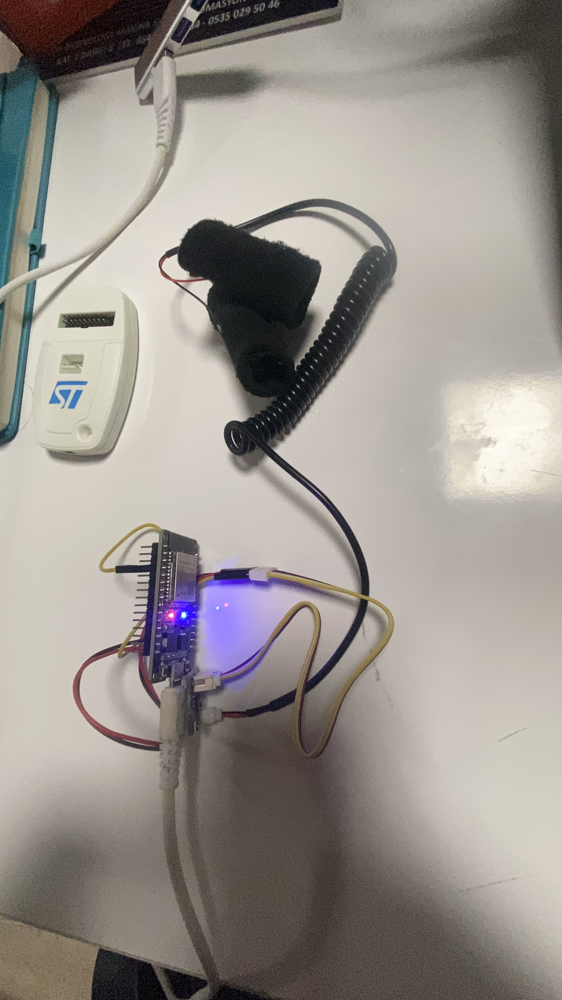
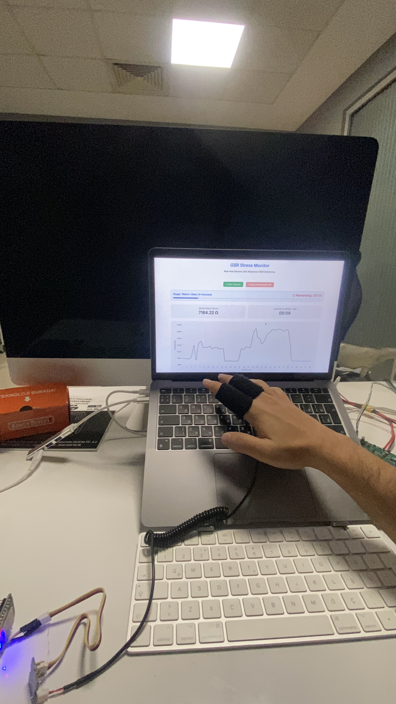
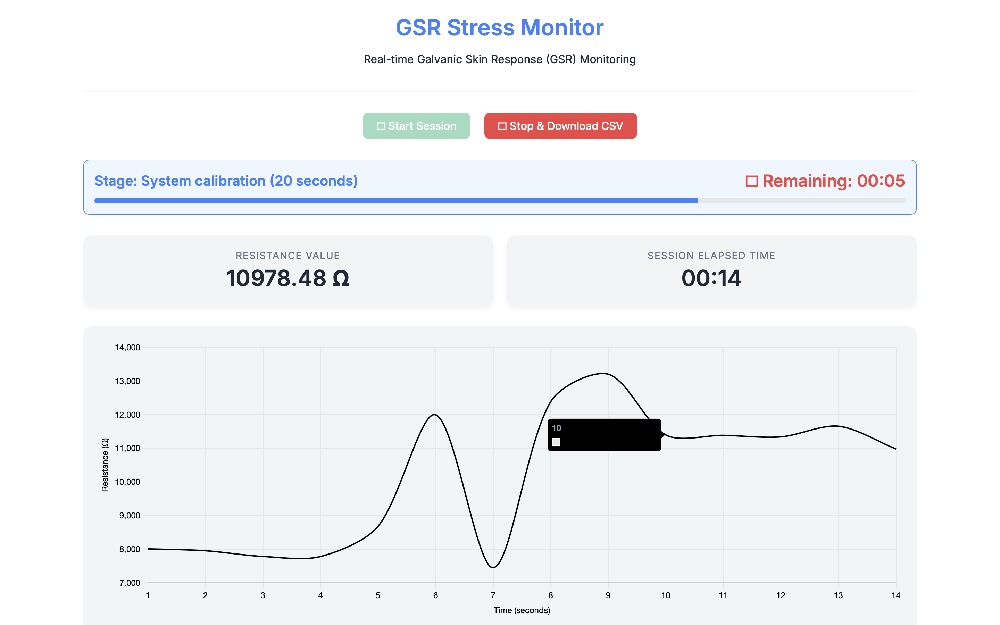
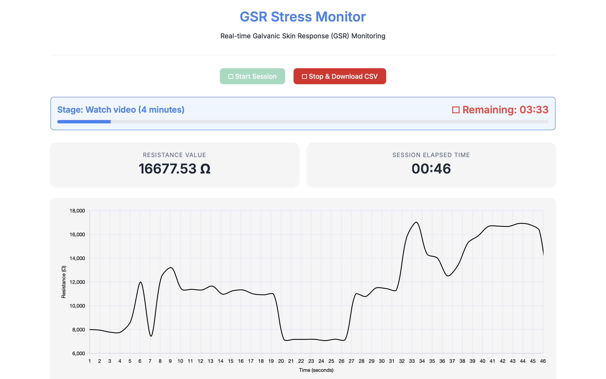
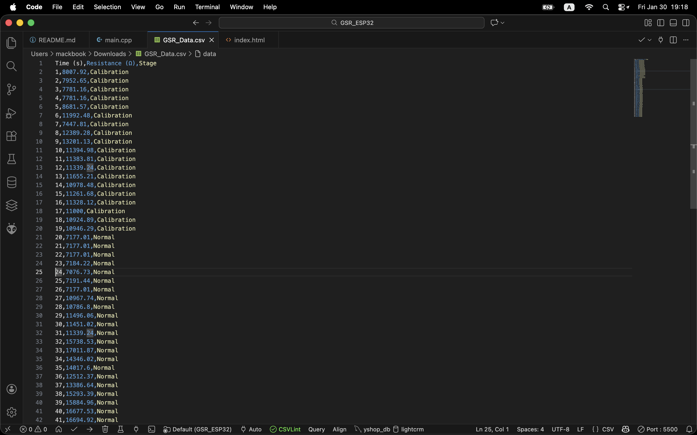

GSR_ESP32
=========

Project to run GSR stress monitor on ESP32 using PlatformIO.

Files:
- src/main.cpp : ESP32 code (HTTP server + GSR reading + web UI)
- platformio.ini : PlatformIO environment

Build & Upload (in project root):

# Mental_Stress_Detection (ESP32 GSR)

Firmware and local UI for a Galvanic Skin Response (GSR) stress-monitoring device based on ESP32.

This repository contains:
- `src/main.cpp` - ESP32 firmware (PlatformIO / Arduino framework)
- `platformio.ini` - PlatformIO project config
- `ui/` - Local UI files and helper scripts (optional local hosting)
	- `ui/index.html` - Local UI (works with the ESP32 AP)
	- `ui/start_local_ui.command` - macOS helper to run a local HTTP server and open Chrome

Important: the camera preview feature was experimented with but is optional; the current recommended workflow is to use the local UI or an Electron wrapper for the best experience.

## Quick start (developer)
Prerequisites:
- PlatformIO (VS Code + PlatformIO extension) or PlatformIO Core CLI
- Python 3 (for the optional local UI server)
- Git

Build & upload firmware (PlatformIO):
```bash
# build and upload to the connected ESP32 (adjust upload-port)
pio run -e esp32dev -t upload --upload-port /dev/cu.usbserial-0001
```
Open serial monitor:
```bash
pio device monitor -p /dev/cu.usbserial-0001 -b 115200
```

## How users should run the UI (non-technical)
Goal: user connects their laptop to the ESP32 Access Point (SSID: `GSR_Monitor`, password `12341234`), opens a browser and views data.

Recommended (no terminal for user):
- Provide users with a packaged Electron app (future). This will be the best one-click experience.

Quick workaround (one-time setup on macOS):
1. Connect the computer to the ESP32 AP `GSR_Monitor` (password `12341234`).
2. Double-click the file `ui/start_local_ui.command` (first time only: make it executable via the Terminal: `chmod +x ui/start_local_ui.command`). This will:
	 - start a local web server on `http://localhost:8000`
	 - open Chrome to `http://localhost:8000/index.html` (local context => camera permission works more reliably)
3. In the opened page press `Enable Camera` (if present) and then `Start Session` to begin logging GSR data.

Notes:
- If you prefer to skip the local helper, you can open `http://192.168.4.1` directly (device AP) — some browsers block camera access from IP/HTTP contexts. Using `localhost` avoids that limitation on Chrome.
- CSV export: the UI provides a CSV download when the session stops.

## Files of interest
- `src/main.cpp` — HTTP endpoints implemented:
	- `/` → serves embedded page (for quick testing)
	- `/start` → starts recording session
	- `/stop` → stops session
	- `/resistance` → returns JSON with current reading
	- `/scan` → Wi‑Fi scan results
	- `/save?ssid=&pass=` → save credentials (attempts STA connect)

- `ui/index.html` — local UI tailored to call `http://192.168.4.1` for device APIs. Use `ui/start_local_ui.command` to serve locally and open in Chrome.

## Push to GitHub
If this is a new repository locally, run the following commands (replace remote URL with your repo):
```bash
git init
git add .
git commit -m "Initial firmware + UI"
git branch -M main
git remote add origin https://github.com/Alansi775/Mental_Stress_Detection.git
git push -u origin main
```

If this repo already exists and you just want to add a remote and push:
```bash
git remote add origin https://github.com/Alansi775/Mental_Stress_Detection.git
git branch -M main
git push -u origin main
```

## Future work
- Package an Electron app (cross-platform) so non-technical users can double-click a single installer and open the UI with camera permissions automatically. (scaffold available upon request)
- Add LLM Vision step: stream short summaries of participant state per second and correlate with GSR signal.

## License
Choose a license before publishing (MIT recommended). If you'd like, I can add an `LICENSE` file.

---
If you'd like, I can now:
- scaffold the Electron wrapper and packaging scripts,
- add an MIT `LICENSE` file,
- or provide an automated `.app`/installer workflow you can run locally to generate distributables.

## Screenshots
Below are photos and screenshots you captured during testing. They show the device, the sensor in use, the web UI while recording, and the exported CSV data.

- **Connecting to ESP32 Wi‑Fi**
	
	*Connecting the Mac to the ESP32 access point (GSR_Monitor) before opening the web UI.*

- **ESP32 with GSR sensor**
	
	*The GSR sensor wired to the ESP32 (device overview).*

- **Monitoring — wearing the sensor**
	
	*Volunteer wearing the GSR sensor while data is being recorded.*

- **Opening the web server & starting recording**
	
	*The moment the web UI is opened and `Start Session` is pressed (calibration stage).*

- **Second stage recording**
	
	*Recording continued into the second (Normal) stage — can be paired with monitoring.jpg for context.*

- **Exported CSV file**
	
	*Downloaded CSV file containing timestamped GSR values used for ML training.*

Make sure the `screenshots/` folder is added to the repository before pushing so these images appear on GitHub.